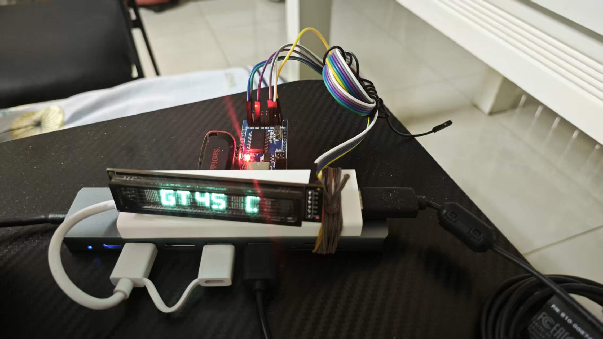

# 项目说明

## 1. 项目开发状态
目前，本项目的全部代码由 **Gemini** 完成。  
后续会加入详细的 **注释** 并进行 **代码优化**，（我自己也看不懂）。

---

## 2. 依赖说明

### CH341A 库
本项目使用的 **CH341A 驱动库** 仅适用于 **64 位 Windows 系统**。  

如果你需要其他平台或不同版本的动态链接库，可以从官方获取：  
[CH341 官方下载页面](https://www.wch.cn/downloads/CH341SER_EXE.html)

---

## 3. 功能概览
目前项目实现的功能包括：

- **音频监测**：实时监测音频输入状态  
- **键盘监测**：记录键盘事件  
- **电脑硬件监测**：获取 CPU、内存等硬件信息

> 后续可能会逐步完善更多功能

---

## 4. 图片示例

